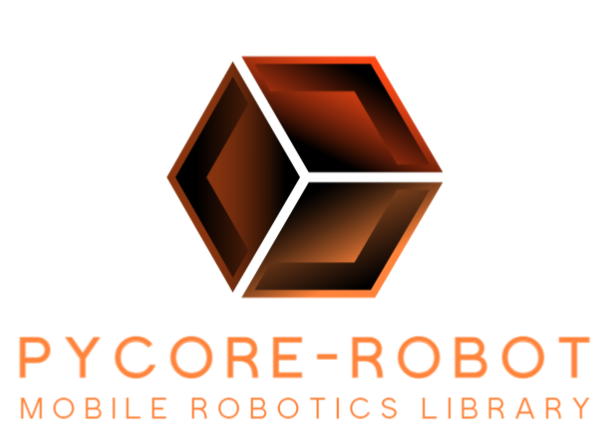

# PyCore-Robot

<!-- PROJECT LOGO -->
<br />
<div align="center">
  <a href="https://github.com/Epic-Robotics/pyCore-robot">
    
  </a>

  <h3 align="center">PyCore-Robot</h3>

  <p align="center">
    Python-Implemented based Mobile Robotics Library
    <br />
    <a href="https://github.com/Epic-Robotics/pyCore-robot/Documentation"><strong>Explore the docs »</strong></a>
    <br />
    <br />
  </p>
</div>


<!-- TABLE OF CONTENTS -->
<details>
  <summary>Table of Contents</summary>
  <ol>
    <li>
      <a href="#about-the-project">About The Project</a>
      <ul>
        <li><a href="#built-with">Built With</a></li>
        <li><a href="#supported-for">Supported For</a></li>
      </ul>
    </li>
    <li>
      <a href="#getting-started">Getting Started</a>
      <ul>
        <li><a href="#prerequisites">Prerequisites</a></li>
        <li><a href="#installation">Installation</a></li>
      </ul>
    </li>
    <li><a href="#usage">Usage</a></li>
    <li><a href="#roadmap">Roadmap</a></li>
    <li><a href="#contributing">Contributing</a></li>
    <li><a href="#license">License</a></li>
    <li><a href="#contact">Contact</a></li>
  </ol>
</details>


<!-- ABOUT THE PROJECT -->
## About The Project

[![Product Name Screen Shot][product-screenshot]](https://example.com)

This project proposes the development of a programming library focused on the study, teaching and learning of mobile robotics concepts based on a real implementation model. The presented work seeks the representation of concepts in educational robotics and advanced robotics under a framework of practicality and simplification that serves as a tool for the study of more complex theories. The development process covers the creation, verification, validation, and implementation of programming functions based on Python language as the programming code base.


<p align="right">(<a href="#readme-top">back to top</a>)</p>


### Built With

The project has been entirely developed in the PYTHON language and is compatible with a wide variety of consoles and development environments.

* 

* 

* 

* 

* 

### Supported For

* 

* 

<p align="right">(<a href="#readme-top">back to top</a>)</p>

<!-- GETTING STARTED -->
## Getting Started

The development of the PyCore_Robot system libraries consists of various sub-libraries focused on different areas of robotics study. Currently, one of them is at a fairly advanced stage of development.

* UcoRobot: Library focused on real-time positioning data acquisition tools in controlled environments using ArUco markers from the Python OpenCV library (currently in development).

* RoverRobot: Library focused on the control and monitoring of medium-sized autonomous robotic units in outdoor environments (in projection).

* AirRobot: Library focused on the control of aerial robotic units, both indoors and outdoors (in projection).

* ChallengeRobot: Library focused on the control of robotic competition units in their various categories (in projection).

### Prerequisites

UcoRobot (ArUco Marker based Mobile
Robotics Library for Autonomous Systems) prerequisites.


* opencv-python
  ```sh
  pip install opencv-python
  ```

* opencv-contrib-python
  ```sh
  pip install opencv-contrib-python
  ```


* numpy
  ```sh
  pip install numpy
  ```

### Installation

1. Clone the repo
   ```sh
   git clone https://github.com/Epic-Robotics/pyCore-robot
   ```
2. Install prerequisites
3. Check the examples

<p align="right">(<a href="#readme-top">back to top</a>)</p>


<!-- USAGE EXAMPLES -->
## Usage

The UcoRobot library primarily employs image processing as a means to calculate kinematic aspects such as position, orientation, and velocity. To achieve this, it is essential to perform proper camera calibration. In the specific case of the library, an upper peripheral camera is used to obtain real-time parameters.

Initialize UcoRobot:

```sh
import ucorobot
```

First, for UcoRobot initial calibration use:

```sh
ucorobot.calibration()
```

Use the chessboard method to calibrate your camera.

[![chessboard_method][chessboard_method]](https://example.com)

You can select your chessboard from [here](https://markhedleyjones.com/projects/calibration-checkerboard-collection).

Next, you need to generate ArUco markers for your robots. You can use this [page](https://fodi.github.io/arucosheetgen/).

Now, you need to assign your functional markers:

```sh
ucorobot.assign()
```
And from here you can use all functions.

_Please refer to the [Examples](https://github.com/Epic-Robotics/pyCore-robot/)_ for more details.

<p align="right">(<a href="#readme-top">back to top</a>)</p>


<!-- ROADMAP -->
## Roadmap

- [x] PyPI indexing _on going_
- [x] Json based UDP communication _on going_
- [x] Real-time angular and linear velocities calculation _on going_
- [x] ROS compatibility _on going_

See the [open issues](https://github.com/othneildrew/Best-README-Template/issues) for a full list of proposed features (and known issues).

<p align="right">(<a href="#readme-top">back to top</a>)</p>


<!-- CONTRIBUTING -->
## Contributing

Contributions are what make the open source community such an amazing place to learn, inspire, and create. Any contributions you make are **greatly appreciated**.

If you have a suggestion that would make this better, please fork the repo and create a pull request. You can also simply open an issue with the tag "enhancement".
Don't forget to give the project a star! Thanks again!

1. Fork the Project
2. Create your Feature Branch (`git checkout -b feature/AmazingFeature`)
3. Commit your Changes (`git commit -m 'Add some AmazingFeature'`)
4. Push to the Branch (`git push origin feature/AmazingFeature`)
5. Open a Pull Request

<p align="right">(<a href="#readme-top">back to top</a>)</p>

<!-- LICENSE -->
## License

Distributed under the MIT License. See `LICENSE.txt` for more information.

<p align="right">(<a href="#readme-top">back to top</a>)</p>


<!-- CONTACT -->
## Contact Us

Marlon Soza M. - [@marlon-s](https://www.linkedin.com/in/k-marlon-soza-m/) - elmarlonsegundo@gmail.com

Carlos Menacho G. - [@carlos-h](https://www.linkedin.com/in/carlos-helsner-menacho-guerra-b933a4119/) - menachocarlos5@gmail.com

Giovanni Blanco G. - [@giovanni-b](https://www.linkedin.com/in/giovanni-alexandro-blanco-gutierrez/) - giometal94@gmail.com

Project Link: [https://github.com/Epic-Robotics/pyCore-robot](https://github.com/Epic-Robotics/pyCore-robot)

<p align="right">(<a href="#readme-top">back to top</a>)</p>


<!-- MARKDOWN LINKS & IMAGES -->
<!-- https://www.markdownguide.org/basic-syntax/#reference-style-links -->
[license-url]: https://github.com/Epic-Robotics/pyCore-robot/LICENSE.txt
[product-screenshot]: md_resources/Graphical.png
[Anaconda]: https://img.shields.io/badge/Anaconda-%2344A833.svg?style=for-the-badge&logo=anaconda&logoColor=white
[Anaconda-url]: https://www.anaconda.com/
[chessboard_method]: md_resources/chessboard_method.png